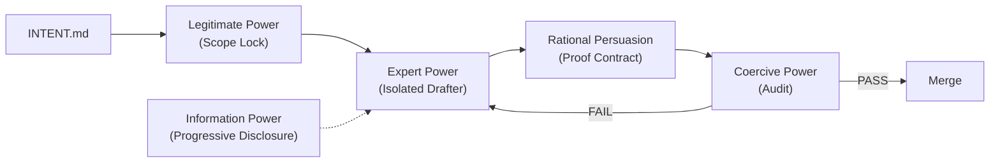
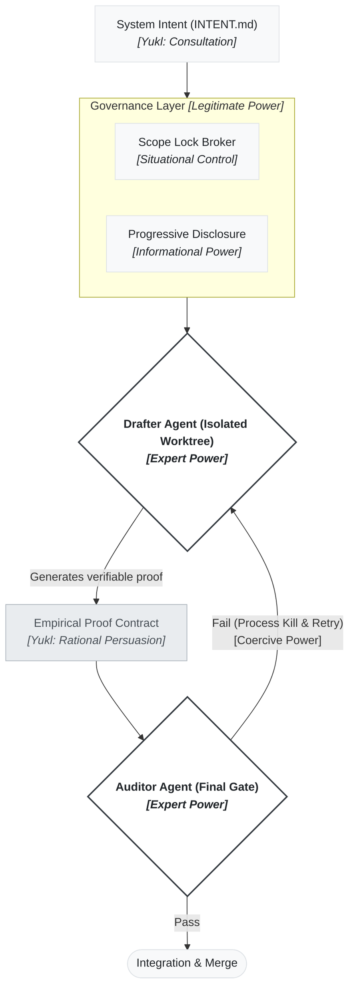

# Yukl-OS: The Power-Based Agent Harness

[](LICENSE)
[](https://github.com/threelittlerunes/yukl-os/actions/workflows/ci.yml)
[](package.json)

> **Govern your agents; do not plead with them.**

Yukl-OS maps French & Raven's bases of power and Yukl's influence tactics onto deterministic pipeline constraints, so an AI workforce is bounded by architecture rather than by good intentions in a prompt.

## Key features

- **Cognitive budget enforcement** - instruction counts are measured and capped, so "too much context" fails the build instead of degrading silently.
- **Power-based role isolation** - each agent holds a defined base of power (Legitimate, Expert, Coercive), not a vague "be a senior developer" persona.
- **Empirical proof contracts** - an agent cannot finish a task without writing executable proof to `.orchestration/contracts/<task_id>.json`.
- **Coercive retry loops** - a failed audit routes the work deterministically back to implementation, up to `maxRetries`, with no human hope required.
- **Path-scoped progressive disclosure** - an agent receives only the rule files matching the paths it is allowed to touch.

## Pipeline



## Quick Start

**1. Install and verify the harness.**

```sh
git clone https://github.com/threelittlerunes/yukl-os.git
cd yukl-os
npm install
npm run build   # validate the harness configuration
npm run test    # instruction-budget check + test suite
```

Node 20 or newer is required.

**2. Install the harness into your project.**

```sh
node scripts/yukl.js init --cwd /path/to/your-project
```

From a feature branch of a Git repository (a clean tree, not the default
branch, not detached), `yukl init` writes `yukl.config.json` with the commands
it detects from `package.json` and `pyproject.toml` (undetected commands are
`null`, never guessed), appends a marked section to any existing `CLAUDE.md`,
`AGENTS.md` or `GEMINI.md`, and installs a CI workflow at
`.github/workflows/yukl.yml` that gates PRs on `yukl verify --base` running a
commit-pinned harness. Subdirectory projects are handled with
`--project-dir app` (auto-detected one level below the root when the root has
no project file), and `--command test=<cmd>` supplies a proof command when
none is detectable; without at least one proof command init refuses rather
than write an invalid config. The harness commit the CI runs must already be
pushed to the yukl-os remote, so push first or pass `--yukl-pin <sha>`.
Re-run init after a merge to update the generated files, passing `--force` to
overwrite an existing config; everything else is left alone.

**3. Declare your intent, then run the pipeline from Orca.**

```sh
cp INTENT.md /path/to/your-project/INTENT.md
```

Edit `INTENT.md` with a one or two sentence objective. When you start the flow, the interactive Legitimate Power stage reads it and interviews you in the terminal to lock the scope before any code is written.

## How It Works



Yukl-OS draws on two distinct organisational-psychology frameworks: **French & Raven's six bases of power** (where influence comes from) and **Yukl's eleven influence tactics** (how influence is attempted). The harness maps each mechanism onto one concept from those frameworks.

| Harness mechanism | Framework | Concept |
|---|---|---|
| Root `CLAUDE.md` router | French & Raven base | Legitimate power |
| Path-scoped rules (`.claude/rules/*.md`) | French & Raven base | Informational power |
| Drafter (specialist implementation) | French & Raven base | Expert power |
| Auditor (independent judgement) | French & Raven base | Expert power |
| Contract verification loop | Yukl tactic | Rational persuasion |
| Mandatory human scope interview | Yukl tactic | Consultation |
| `onFailGoto` retry and process kill | French & Raven base | Coercive power |
| Isolated Git worktree and lock broker | Structural design | Environment shapes behaviour |

Power bases originate from French & Raven (1959); Yukl's taxonomy (1990) integrates them with eleven influence tactics into a unified model.

Two non-mappings are deliberate. **Referent power** (influence through admiration) is a human social mechanism with no meaningful agent equivalent, so the harness does not claim it. **Reward power** is a known gap, recorded in section 3.2 of the architecture document.

## Agent support

The harness is agent-agnostic. `CLAUDE.md` carries the constitution for Claude Code, and `AGENTS.md` carries the same rules for agents that read AGENTS.md. Whichever agent writes the code, the deterministic checks - `npm run build`, `npm run test` and CI - are the binding layer that verifies it.

## Architecture

The harness treats the repository as a constitution and the pipeline as its enforcement. A router stage establishes the scope, a Drafter implements inside an isolated worktree, and an Auditor executes the Drafter's empirical proof before approving the work. Instruction budgets, path-scoped rules and advisory locks keep every agent inside its lane. The full rationale, the 12-Factor Agents gap analysis and the known capability gaps live in [docs/YUKL_ARCHITECTURE.md](docs/YUKL_ARCHITECTURE.md).

## Contributing

Contributions are held to the standard the harness enforces: small scope, empirical proof, no vibes. See [CONTRIBUTING.md](CONTRIBUTING.md) for the contribution contract, and [CODE_OF_CONDUCT.md](CODE_OF_CONDUCT.md) for participation. Report vulnerabilities per [SECURITY.md](SECURITY.md), not in a public issue.

## Licence

MIT - see [LICENSE](LICENSE).
